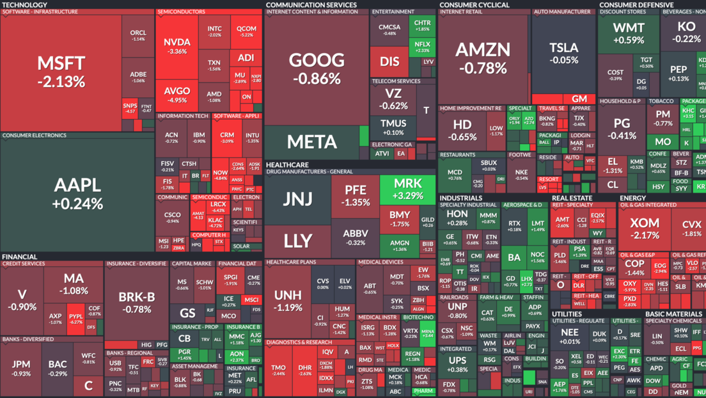

<h1 align="center">Análisis de inversión del Indice S&P500</h1>

## Contexto: 

En este proyecto simulamos una situación en donde una empresa busca invertir en el S&P500 y
nos solicita analizarlo en detalle. Como expertos en datos, y cumpliendo nuestro rol, estamos en capacidad de brindar una explicación 
de lo que ha sucedido en este mercado en los últimos años (considerando impactos positivos y negativos a partir del año 2000), 
recomendaciones de inversión y otra información complementaria. 

## Desarrollo:
En primer lugar, realizamos un Análisis Exploratorio de los datos (EDA) con el fin de comprender mejor los datos y encontrar patrones, 
outliers y/o anomalías. El reporte se presenta en un notebook (.ipynb) con adecuado uso de markdowns y comentarios y
contiene un resumen de estadísticas descriptivas de los datasets, y analisis varios. Encontramos información relevante que nos ayudó
a entender mejor el mercado bursátil en los últimos años, ademas de lograr situarlo con el contexto economico mundial en momentos criticos y su relación con
el mercado.

Luego,creamos un Dashboard usando streamlit y coherente con el análisis realizado. 
El archivo está disponible en nuestro repositorio (.pbix) y contiene información relevante sobre las empresas pertenecientes al índice SP500.
Incluimos gráficos interactivos que nos permiten ver la variación de precios en el tiempo, comparar entre distintas acciones, 
cálculo de estadísticas bursátiles y recomendaciones basadas en el retorno y riesgo de inversión.

Además, sugerimos 3 KPIs que aparecen en el Dashboard relaciionados con nuestro analisis.
Explicamos en la presentación el análisis y la funcionalidad de los KPIs sugeridos.

## Conclusiones:
En este proyecto, analizamos el mercado bursátil en los últimos 23 años a partir del índice SP500.
Pudimos reelevar algunos datos, que nos indico que durante el período analizado el indice tuvo un rendimiento positivo anual promedio del %8.4,
ademas de que es un buen indicadr del rendimiento general del mercado de valores de EE.UU, pero tambien se ve afectado por factores macroeconomicosy decisiones 
politicas. Tambien, logramos observar que la crisis del 2008, relacionada con los creditos hipotecarios, tuvo un impacto muy significativo, el indice tardo varios años 
en recupersarse por completo. 
En general, es importante tener en cuenta que cualquier análisis histórico del S&P 500 no garantiza el rendimiento futuro del índice o de cualquier inversión relacionada.
Es fundamental realizar un análisis cuidadoso y seguir una estrategia de inversión bien fundamentada y diversificada.
Cabe aclarar que esto no no debe interpretarse en ningún caso como una recomendación de inversión o un asesoramiento financiero, es solo un proyecto de analisis de datos.
